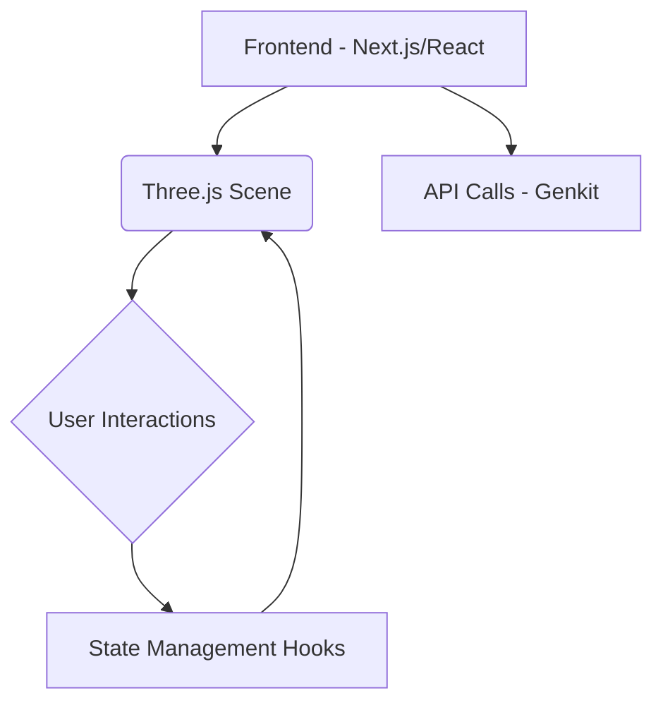

# Documentação do Sistema Terminal 3D

Bem-vindo à documentação do projeto Terminal 3D.

Este site fornece:

- Uma visão geral dos [Requisitos e Arquitetura do Sistema](architecture.md).
- [Documentação detalhada da API](api/README.md) gerada a partir do código-fonte.

Utilize a barra lateral para navegar pelas diferentes seções.

## Como Visualizar Localmente

1.  Certifique-se de ter o Node.js e o npm instalados.
2.  Instale as dependências do projeto: `npm install`
3.  Gere a documentação da API: `npm run docs:build`
4.  Inicie o servidor de documentação local: `npm run docs:serve`
5.  Abra [http://localhost:8081](http://localhost:8081) no seu navegador.

## Diagramas

Diagramas Mermaid podem ser embutidos diretamente nos arquivos Markdown ou gerados pelo TypeDoc a partir de comentários `@mermaid` no código-fonte.

Exemplo de diagrama Mermaid embutido:

