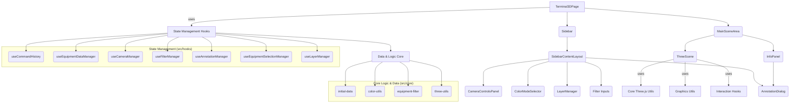

# Arquitetura e Requisitos de Software - Terminal 3D

Este documento detalha a arquitetura do sistema Terminal 3D, requisitos funcionais, não funcionais e as tecnologias utilizadas.

## 1. Visão Geral do Sistema

O sistema Terminal 3D visa fornecer uma visualização interativa em três dimensões de um terminal industrial (portuário, de mineração, etc.), permitindo aos usuários monitorar equipamentos, seus estados operacionais, produtos associados e adicionar anotações.

## 2. Requisitos Funcionais (RF)

-   **RF001**: O sistema deve exibir uma cena 3D representando o terminal e seus equipamentos.
-   **RF002**: O sistema deve permitir a navegação (zoom, pan, órbita) na cena 3D.
-   **RF003**: O sistema deve exibir informações detalhadas de um equipamento ao ser selecionado.
    -   **RF003.1**: As informações devem incluir nome, TAG, tipo, sistema, área, estado operacional, produto e detalhes textuais.
-   **RF004**: O sistema deve permitir a alteração do estado operacional de um equipamento.
-   **RF005**: O sistema deve permitir a alteração do produto associado a um equipamento (quando aplicável).
-   **RF006**: O sistema deve permitir a adição, edição e remoção de anotações textuais para cada equipamento.
    -   **RF006.1**: Cada anotação deve registrar a data de criação/modificação.
-   **RF007**: O sistema deve permitir filtrar os equipamentos exibidos por:
    -   **RF007.1**: Termo de busca (nome, TAG, tipo).
    -   **RF007.2**: Sistema.
    -   **RF007.3**: Área.
-   **RF008**: O sistema deve permitir o controle de visibilidade de diferentes camadas de objetos (e.g., prédios, tanques, tubulações, anotações, terreno).
-   **RF009**: O sistema deve permitir colorir os equipamentos na cena 3D com base em:
    -   **RF009.1**: Cor base do equipamento.
    -   **RF009.2**: Estado operacional.
    -   **RF009.3**: Produto.
-   **RF010**: O sistema deve permitir focar a câmera em um sistema específico, enquadrando todos os equipamentos daquele sistema.
-   **RF011**: O sistema deve manter um histórico de comandos para ações que alteram o estado (e.g., seleção, mudança de câmera, visibilidade de camada), permitindo operações de "Desfazer" (Undo) e "Refazer" (Redo).
    -   **RF011.1**: As alterações de estado operacional e produto não são, por padrão, parte do histórico de undo/redo, pois representam modificações diretas nos dados "reais".
    -   **RF011.2**: A criação, edição ou exclusão de anotações também não fazem parte do histórico de undo/redo, pois são persistidas diretamente.
-   **RF012**: O sistema deve gerar e manter automaticamente a documentação técnica (API, arquitetura, fluxos) e diagrama de classes a partir do código-fonte e comentários, usando ferramentas open-source.
-   **RF013**: A documentação gerada deve ser acessível através de um link na interface do sistema.

## 3. Requisitos Não Funcionais (RNF)

-   **RNF001**: **Desempenho**: A renderização da cena 3D deve ser fluida, com uma taxa de quadros aceitável (mínimo 30 FPS) em hardware moderno.
-   **RNF002**: **Usabilidade**: A interface do usuário deve ser intuitiva e fácil de usar.
-   **RNF003**: **Manutenibilidade**: O código deve ser bem organizado, modularizado, comentado e seguir boas práticas de desenvolvimento para facilitar futuras manutenções e evoluções.
-   **RNF004**: **Portabilidade**: A aplicação deve ser acessível via navegador web moderno (Chrome, Firefox, Edge, Safari).
-   **RNF005**: **Confiabilidade**: O sistema deve ser estável e não apresentar falhas frequentes.
-   **RNF006**: **Extensibilidade**: A arquitetura deve permitir a fácil adição de novos tipos de equipamentos ou funcionalidades.
-   **RNF007**: **Segurança**: Não aplicável para este escopo inicial (sem autenticação ou dados sensíveis persistidos no backend).

## 4. Arquitetura de Software

O sistema é uma aplicação web Single Page Application (SPA) construída com Next.js (React). A visualização 3D é implementada com Three.js.

### 4.1. Componentes Principais

1.  **`Terminal3DPage` (`src/app/page.tsx`)**:
    *   Componente principal da página.
    *   Orquestra os diversos hooks de gerenciamento de estado.
    *   Renderiza a `MainSceneArea` e a `Sidebar`.
    *   Gerencia estados locais da UI (e.g., modo de colorização).

2.  **Hooks de Gerenciamento de Estado (`src/hooks/`)**:
    *   **`useCommandHistory`**: Gerencia o histórico de comandos para Undo/Redo.
    *   **`useEquipmentDataManager`**: "Fonte da verdade" para os dados dos equipamentos e suas modificações diretas.
    *   **`useCameraManager`**: Gerencia o estado da câmera 3D (posição, lookAt, foco em sistemas).
    *   **`useFilterManager`**: Gerencia os critérios de filtro (busca, sistema, área) e a lista de equipamentos filtrados.
    *   **`useAnnotationManager`**: Gerencia o estado das anotações (CRUD, diálogo).
    *   **`useEquipmentSelectionManager`**: Gerencia a seleção de equipamentos (single, multi, hover).
    *   **`useLayerManager`**: Gerencia a visibilidade das camadas.

3.  **Componentes da Cena 3D (`src/components/`)**:
    *   **`MainSceneArea`**: Contêiner para a `ThreeScene` e o `InfoPanel`.
    *   **`ThreeScene`**: Componente React que encapsula toda a lógica de renderização e interação com a cena Three.js.
        *   Utiliza utilitários de `src/core/three/` para setup da cena, meshes, interações, etc.
        *   Utiliza o hook `useSceneOutline` para o efeito de contorno.
        *   Utiliza o hook `useAnimationLoop` para o loop de renderização.
    *   **`InfoPanel`**: Exibe detalhes do equipamento selecionado e permite interações (mudar estado, produto, anotações).

4.  **Componentes da Sidebar (`src/components/`)**:
    *   **`Sidebar` (e subcomponentes de `src/components/ui/sidebar.tsx`)**: Estrutura da sidebar.
    *   **`SidebarContentLayout`**: Conteúdo da sidebar (filtros, controles de câmera, seletor de cor, gerenciador de camadas).
    *   **`CameraControlsPanel`**: Botões para focar em sistemas.
    *   **`ColorModeSelector`**: Dropdown para mudar o modo de colorização.
    *   **`LayerManager`**: Checkboxes para visibilidade das camadas.
    *   **`AnnotationDialog`**: Diálogo para adicionar/editar anotações.

5.  **Lógica Core (`src/core/`)**:
    *   **`data/initial-data.ts`**: Fornece os dados iniciais para equipamentos e camadas.
    *   **`graphics/color-utils.ts`**: Lógica para determinar a cor dos equipamentos.
    *   **`logic/equipment-filter.ts`**: Lógica de filtragem dos equipamentos.
    *   **`three/`**: Módulos utilitários específicos para Three.js:
        *   `camera-utils.ts`: Funções para manipulação de câmera (e.g., enquadrar objetos).
        *   `equipment-geometry-factory.ts`: Cria geometrias 3D para os equipamentos.
        *   `label-renderer-utils.ts`: Gerencia os pins de anotação (CSS2DObjects).
        *   `mouse-interaction-manager.ts`: Processa cliques e movimentos do mouse na cena.
        *   `postprocessing-utils.ts`: Configura e atualiza o `OutlinePass`.
        *   `scene-elements-setup.ts`: Configura elementos básicos da cena (luzes, chão, renderizadores).

6.  **Tipos Compartilhados (`src/lib/types.ts`)**: Define as interfaces principais (Equipment, Layer, Command, etc.).

7.  **Componentes de UI (`src/components/ui/`)**: Componentes ShadCN UI customizados e básicos.

### 4.2. Fluxo de Dados e Interações (Exemplos)

*   **Seleção de Equipamento**:
    1.  Usuário clica em um equipamento na `ThreeScene`.
    2.  `ThreeScene` (via `mouse-interaction-manager`) detecta o clique e o equipamento alvo.
    3.  Chama `handleEquipmentClick` de `useEquipmentSelectionManager`.
    4.  `useEquipmentSelectionManager` atualiza `selectedEquipmentTags` e cria um comando para o `useCommandHistory`.
    5.  `Terminal3DPage` recebe `selectedEquipmentTags` atualizado e passa para `InfoPanel` (para exibir detalhes) e `ThreeScene` (para o efeito de contorno via `useSceneOutline`).

*   **Filtragem**:
    1.  Usuário digita no campo de busca ou seleciona um sistema/área na `SidebarContentLayout`.
    2.  Callbacks (`setSearchTerm`, `setSelectedSistema`, `setSelectedArea`) de `useFilterManager` são chamados.
    3.  `useFilterManager` recalcula `filteredEquipment` usando `getFilteredEquipment`.
    4.  `Terminal3DPage` recebe `filteredEquipment` atualizado e passa para `ThreeScene`.
    5.  `ThreeScene` atualiza os meshes visíveis na cena.

### 4.3. Diagrama de Componentes de Alto Nível (Mermaid)

## 5. Tecnologias Utilizadas

*   **Frontend Framework**: Next.js (v15.x) com React (v18.x)
*   **Linguagem**: TypeScript
*   **Renderização 3D**: Three.js
*   **Componentes UI**: ShadCN UI
*   **Estilização**: Tailwind CSS
*   **Geração de Documentação**:
    *   TypeDoc (com typedoc-plugin-markdown e typedoc-plugin-mermaid)
*   **Controle de Versão**: Git
*   **Gerenciador de Pacotes**: npm

## 6. Documentação da API

A documentação detalhada da API, gerada a partir dos comentários do código-fonte, pode ser encontrada aqui:
[Ver Documentação da API](./api/README.md)
